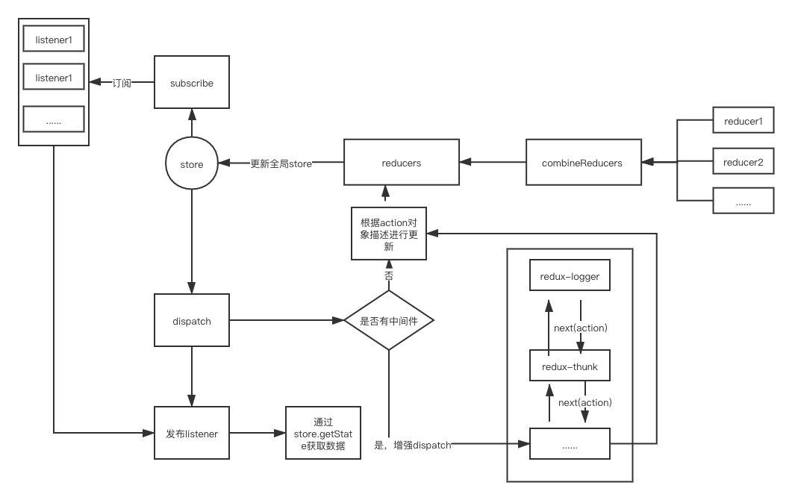

> 首先，我们需要知道redux的相关概念

# 概念

首先，我们需要知道redux有以下概念

1. Action：一个JavaScript对象，描述动作相关信息，必须要包含的是一个type属性，用于描述当前Action，其他属性为值。

2. Reducer：定义应用状态如何响应不同动作（action），如何更新状态；
3. Store：管理action和reducer及其关系的对象，主要提供以下功能：

    - 维护应用状态并支持访问状态（getState()）；
    - 支持监听action的分发，更新状态（dispatch(action)）；
    - 支持订阅store的变更（subscribe(listener)）；

首先可以先看一下流程图
<div align="center">
   
</div>

> 我使用的是`npm run build`后的代码讲解的

## createStore

先从`createStore`的源码说起，我们看如下的源码:
```js
    // 只传两个参数的，且第二个参数为函数时，作为enhancer
    if (typeof preloadedState === 'function' && typeof enhancer === 'undefined') {
      enhancer = preloadedState;
      preloadedState = undefined;
    }
  
    if (typeof enhancer !== 'undefined') {
      if (typeof enhancer !== 'function') {
        throw new Error('Expected the enhancer to be a function.');
      }
      
      // 则enhancer就是 applyMiddleware 的返回值，enhancer也是一个高阶函数
      return enhancer(createStore)(reducer, preloadedState);
    }
```
以上的代码是为 applyMiddleware(自定义中间件) 服务的，如果增加了自定义中间件会进入enhancer分支，对dispatch进行增强。enhancer会在后面说到

然后，我们看一下在createStore中的局部变量
```js
// currentReducer必须是一个函数，用来定义响应不同action
var currentReducer = reducer;
// 更新后的state
var currentState = preloadedState;
var currentListeners = [];
// nextListeners 则是存放 监听器 的变量
var nextListeners = currentListeners;
var isDispatching = false;
```

以上，主要的是`currentReducer`、`currentState`和`nextListeners`。
它们的作用分别是:

currentReducer: 保存传入到createStore的reducer
currentState: 更新后的值，getState 方法获取的就是这个局部变量
nextListeners: 当使用subscribe来注册一个监听器的时候，都会被push到这里，并且dispatch时，会调用执行所有的监听器

## getState
这个方法比较简单，它只获取createStore中的局部变量currentState, 也就是我们的全局store
```js

function getState() {
    if (isDispatching) {
        throw new Error('You may not call store.getState() while the reducer is executing. ' + 'The reducer has already received the state as an argument. ' + 'Pass it down from the top reducer instead of reading it from the store.');
    }

    return currentState;
}
```

## subscribe
redux采用的是发布-订阅模式来监听store的变化，subscribe则是一个订阅函数。
```js

function subscribe(listener) {

    var isSubscribed = true;
    ensureCanMutateNextListeners();
    nextListeners.push(listener);
    return function unsubscribe() {
        if (!isSubscribed) {
            return;
        }

        isSubscribed = false;
        ensureCanMutateNextListeners();
        var index = nextListeners.indexOf(listener);
        nextListeners.splice(index, 1);
        currentListeners = null;
    };
}
```

他会将注册的监听器存放到 `nextListeners`中，可以通过unsubscribe来注销监听器。
而在nextListeners中的监听器，都会在dispatch时被调用，在这之后使用getState获取到的都是更新后的store。在`react-redux`中就是通过在Provider中使用subscribe注册监听器，然后在监听器中获取到更新后的store进行派发。


## dispatch

以下是dispatch中组要的逻辑
```js

try {
    isDispatching = true;
    // 接收到 combination 计算的值后，更新 currentState
    currentState = currentReducer(currentState, action);
} finally {
    isDispatching = false;
}

// 获取 nextListeners 中的 监听器
var listeners = currentListeners = nextListeners;

// 遍历并执行通过subscribe订阅的监听器
for (var i = 0; i < listeners.length; i++) {
    var listener = listeners[i];
    listener();
}
```
dispatch 则是根据action来执行reducer中不同的更新逻辑，然后返回最新的store，并且执行监听器(发布)。这样，就可以获取到最新的store来做相应的更新操作。


当然，一般的业务中，通常会有多个reducer，这个时候就需要通过combineReducer来合并多个reducer。它的主要逻辑如下:

```js

    // 接收 old state 和 描述action的对象
    return function combination(state, action) {
      if (state === void 0) {
        state = {};
      }

        //   .......
  
      var hasChanged = false;
      var nextState = {};
  
      for (var _i = 0; _i < finalReducerKeys.length; _i++) {
        // _key 是 每个reducer对应的key，
        // 如： combineReducers({ toDo: todoReducer })
        // _key 就是 toDo
        // reducer 就是 todoReducer
        var _key = finalReducerKeys[_i];
        var reducer = finalReducers[_key];
        var previousStateForKey = state[_key];

        // 开始执行项目中定义的reducer，并且传入old state中对应的reducer的值
        // nextStateForKey 就是新的值
        var nextStateForKey = reducer(previousStateForKey, action);
  
        // 更新全局store上的当前action对应的state
        nextState[_key] = nextStateForKey;
        hasChanged = hasChanged || nextStateForKey !== previousStateForKey;
      }
  
      // 判断是否有变化
      hasChanged = hasChanged || finalReducerKeys.length !== Object.keys(state).length;

      // 如果有变化，则采用 nextState，如果没有则返回old state
      return hasChanged ? nextState : state;
    };
```
这就是在使用 `combinerReducer`时返回的新的reducer。在每一次更新时，都会进行一次遍历，来对比相应reducer中的state是否发生变化。更新则采用nextState,否则返回old state。


## applyMiddleware

中间件的作用就是增强dispatch的功能，常见的有 `redux-logger`、`redux-thunk`等等。

redux-logger: 支持在dispatch时输出更改前后更改后的数据
redux-thunk: 则是支持dispatch一个函数，这可以完成一个控制反转，来使dispatch支持异步调用。

```js

  // applyMiddleware 是一个高阶函数
  function applyMiddleware() {
    // 使用如下中间件
    // applyMiddleware(logger, thunk)
    // 则 middlewares = [logger, thunk]
    for (var _len = arguments.length, middlewares = new Array(_len), _key = 0; _key < _len; _key++) {
      middlewares[_key] = arguments[_key];
    }
  
    // 返回一个enhancer，也就是createStore的第三个参数
    return function (createStore) {
      return function (reducer, preloadedState) {
        // 通过高阶函数，store的权限交出
        var store = createStore(reducer, preloadedState);
  
        var _dispatch = function dispatch() {
          throw new Error('Dispatching while constructing your middleware is not allowed. ' + 'Other middleware would not be applied to this dispatch.');
        };
  
        var middlewareAPI = {
          getState: store.getState,
          dispatch: function dispatch(action) {
            for (var _len2 = arguments.length, args = new Array(_len2 > 1 ? _len2 - 1 : 0), _key2 = 1; _key2 < _len2; _key2++) {
              args[_key2 - 1] = arguments[_key2];
            }
  
            return _dispatch.apply(void 0, [action].concat(args));
          }
        };
        var chain = middlewares.map(function (middleware) {
          // 遍历并调用中间件，传入由 middleware 控制的getState和dispatch
          // 每一个middleware应该也是一个高阶函数
          return middleware(middlewareAPI);
        });
        
        // chain就是每个中间件return的第二层函数
        // compose会从右到左，执行所有中间件。直到执行到最开始的一个中间件中
        // 然后返回一个新的dispatch, 这个dispatch 就是中间件代码中最深层的匿名函数了 return (action) => {}
        _dispatch = compose.apply(void 0, chain)(store.dispatch);

        // 返回一个增强 dispatch 后的 store
        // 然后再调用 dispatch 时，会按照中间件的顺序执行，然后中间件中通过next，进入下一个中间件中（进入调用栈),然后出栈，这个时候，获取到的state为新的值
        return _objectSpread2(
          _objectSpread2({}, store),
          {},
          { dispatch: _dispatch }
        );
      };
    };
  }
```

applyMiddleware 机制的核心在于组合 compose，将不同的 middlewares 一层一层包裹到原生的 dispatch 之上，而为了方便进行 compose，需对 middleware 的设计采用柯里化 curry 的方式，达到动态产生 next 方法以及保持 store 的一致性。由于在 middleware 中，可以像在外部一样轻松访问到 store, 因此可以利用当前 store 的 state 来进行条件判断，用 dispatch 方法拦截老的 action 或发送新的 action。

总结：
1. redux采用的是发布订阅模式
2. dispatch会触发linsters
3. middleware 的设计则采用柯里化，达到动态产生 next 方法以及保持 store 的一致性。