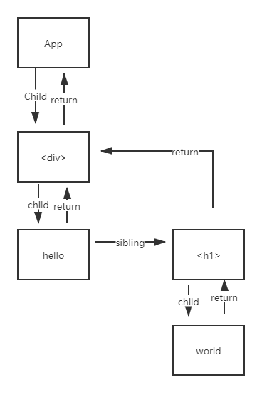

# [文章出处](https://react.iamkasong.com/preparation/idea.html#%E7%90%86%E8%A7%A3-%E9%80%9F%E5%BA%A6%E5%BF%AB)

## 理念
来自官网
> 我们认为，React 是用 JavaScript 构建快速响应的大型 Web 应用程序的首选方式。它在 Facebook 和 Instagram 上表现优秀。


对于框架来说，快速响应的性能是每个框架的特点。

那么如何理解**快速响应**。可以从以下两个角度看：

相比较Vue、angular使用模板语言的React，它采用的是原生js的写法，在开发UI界面时增加了更多的灵活性,但是高灵活性意味着高不确定性。

比如用Vue语句
```js
  <template>
      <ul>
          <li>0</li>
          <li>{{ name }}</li>
          <li>2</li>
          <li>3</li>
      </ul>
  </template>
```

当编译时，由于模版语法的约束，Vue可以明确知道在li中，只有name是变量，这可以提供一些优化线索。

而在React中，以上代码可以写成如下JSX：

```jsx
function App({name}) {
    const children = [];
    for (let i = 0; i < 4; i++) {
        children.push(<li>{i === 1 ? name : i}</li>)
    }
    return <ul>{children}</ul>
}
```

由于语法的灵活，在编译时无法区分可能变化的部分。所以在运行时，React需要遍历每个li，判断其数据是否更新。

基于以上原因，相比于Vue、Angular，缺少编译时优化手段的React为了速度快需要在运行时做出更多努力。

比如

- 使用PureComponent或React.memo构建组件
- 使用shouldComponentUpdate生命周期钩子
- 渲染列表时使用key
- 使用useCallback和useMemo缓存函数和变量

由开发者来显式的告诉React哪些组件不需要重复计算、可以复用。


### 老的React架构

Reconciler -> Renderer

- Reconciler（协调器）—— 负责找出变化的组件
- Renderer（渲染器）—— 负责将变化的组件渲染到页面上

### 新的React架构

Scheduler -> Reconciler -> Renderer

- Scheduler（调度器）—— 调度任务的优先级，高优任务优先进入Reconciler
- Reconciler（协调器）—— 负责找出变化的组件
- Renderer（渲染器）—— 负责将变化的组件渲染到页面上

### 代数效应与Generator
> 代数效应是函数式编程中的一个概念，用于将副作用从函数调用中分离。

从React15到React16,reconciler重构的一大目标就是：将老的`同步更新`的架构编程`异步可中断更新`;

`异步可中断更新`可以理解为：`更新`在执行过程中可能被打断（浏览器时间分片用尽或有更高优任务插队），当可以继续执行时恢复之前执行的中间状态。

这就是`代数效应`的提现


### Fiber架构

在React15及以前，Reconciler采用递归的方式创建虚拟DOM，递归过程是不能中断的。如果组件树的层级很深，递归会占用线程很多时间，造成卡顿。

为了解决这个问题，React16将递归的无法中断的更新重构为异步的可中断更新，由于曾经用于递归的虚拟DOM数据结构已经无法满足需要。于是，全新的Fiber架构应运而生。

**Fiber结构**

1. 作为架构
```js
// 指向父级Fiber节点
this.return = null;
// 指向子Fiber节点
this.child = null;
// 指向右边第一个兄弟Fiber节点
this.sibling = null;
```

组件结构
```jsx
const App = () => {
  return (
    <div>
      hello
      <h1>world</h1>
    </div>
  )
}
```
对应Fiber树
<div align="center">
   
</div>

2. 作为静态的数据结构
```js
// Fiber对应组件的类型 Function/Class/Host...
this.tag = tag;
// key属性
this.key = key;
// 大部分情况同type，某些情况不同，比如FunctionComponent使用React.memo包裹
this.elementType = null;
// 对于 FunctionComponent，指函数本身，对于ClassComponent，指class，对于HostComponent，指DOM节点tagName
this.type = null;
// Fiber对应的真实DOM节点
this.stateNode = null;
```

3. 作为动态的工作单元
```js
// 保存本次更新造成的状态改变相关信息
this.pendingProps = pendingProps;
this.memoizedProps = null;
this.updateQueue = null;
this.memoizedState = null;
this.dependencies = null;

this.mode = mode;

// 保存本次更新会造成的DOM操作
this.effectTag = NoEffect;
this.nextEffect = null;

this.firstEffect = null;
this.lastEffect = null;
```

一下两个字段保存调度优先级
```js
// 调度优先级相关
this.lanes = NoLanes;
this.childLanes = NoLanes;
```

### 双缓存
react采用的**双缓存**技术。react中同时最多可以存在两颗`Fiber树`。当前屏幕展示的为`current fiber`。正在内存中构建的为`workInProgress fiber树`。

它们通过`alternate`属性相连。
```js
currentFiber.alternate = workInProgress;
workInProgress.altername = currentFiber;
```
react应用的根节点(`fiberRootNode`)通过`current`指针在不同的fiber树的`rootFiber`之间切换来实现`Fiber树`的切换。

### 源码术语
- Reconciler工作的阶段被称为render阶段。因为在该阶段会调用组件的render方法。
- Renderer工作的阶段被称为commit阶段。就像你完成一个需求的编码后执行git commit提交代码。commit阶段会把render阶段提交的信息渲染在页面上。
- render与commit阶段统称为work，即React在工作中。相对应的，如果任务正在Scheduler内调度，就不属于work。