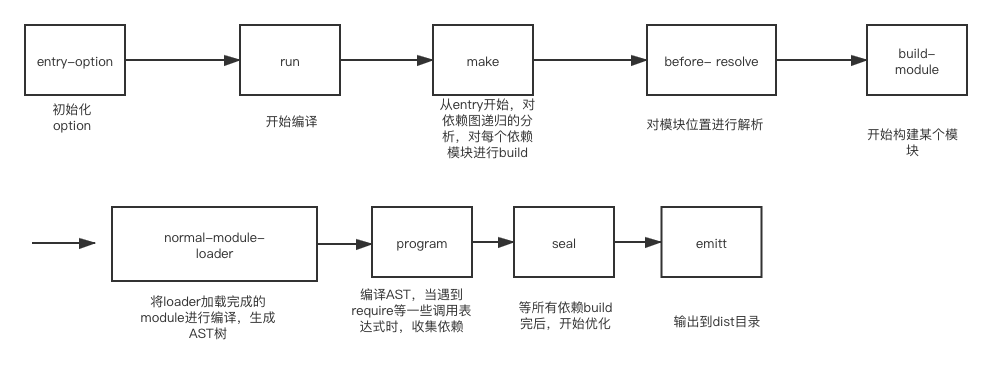

### Compiler和Tapable插件架构与hooks

`Compiler`是webpack中用来编译的核心对象，它继承了`Tapable`

Tapable 是一个类似于Node.js的EventEmmiter的库，主要控制钩子函数的发布与订阅，
控制着webpack的插件系统。

Tapable库暴露了很多Hook（钩子）类，为插件提供挂载的钩子
```js
const {
    SyncHook, // 同步钩子
    SyncBailHook, // 同步熔断钩子 
    SyncWaterfallHook, // 同步流水钩子
    SyncLoopHook, // 同步循环钩子
    AsyncParallelHook, // 异步并发钩子
    AsyncParallelBailHook, // 异步并发熔断钩子
    AsyncSeriesHook, // 异步串行钩子
    AsyncSeriesBailHook, // 异步串行熔断钩子
    AsyncSeriesWaterfallHook, // 异步串行流水钩子
} = require('tapable')
```


### 构建流程

<div align="center">
   
</div>

