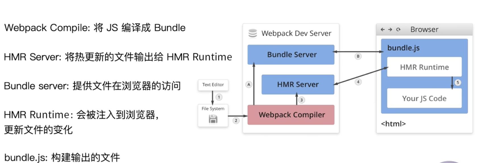

### entry

1. 单一入口（单页应用）
```js
module.exports = {
    entry: './src/index.js'
}
```

2. 多入口（多页应用）
```js
module.exports = {
    entry: './src/index.js',
}
```


### output
2. 单入口（单页应用）
```js
module.exports = {
    entry: {
        app: './src/app.js',
        serach: './src/search.js'
    },
    output: {
        filename: 'bundle.js',
        path: __dirname + '/dist'
    }
}
```


2. 多入口（多页应用）
```js
module.exports = {
    entry: {
        app: './src/app.js',
        serach: './src/search.js'
    },
    output: {
        filename: '[name].js',
        path: __dirname + '/dist'
    }
}
```


### loaders

在webpack中，只支持js和json两种文件类型，通过添加loaders去支持其他类型的文件，并且将它们转化成为有效的模块，添加到依赖图中。

它的本身是一个函数，以源文件作为参数，返回转换后的结果。

比如，jsx、ts、字体文件、图片等等

**常见的loader**

名称                     |描述
|-----------            | -----
babel-loader            |转换es6、es7、等js新特性
css-loader              |支持.css文件的加载和解析
less-loader             |将.less文件转化为css
ts-loader               |将ts转化为js
file-loader             |进行图片、字体等的打包
raw-loader              |将文件以字符串的形式导入
thread-loader           |多进程打包js和css

```js
module.exports = {
    module: {
        rules: [
            {
                test: /\.txt$/,
                use: 'raw-loader'
            }
        ]
    }
}
```

text -> 制定匹配规则

use -> 制定当前要使用的loader


### plugins

它是对loaders的一个增强

通常用于bundle 文件的优化，资源管理和环境变量的注入

### 解析css、less、sass


### webpack的文件监听

在webpack中，可以在命令中配置`--watch`来监听文件的变化，这样就可以不需要每次更改源代码之后再去执行命令行的命令了。

但是这有一个缺点，就是需要手动刷新浏览器

**原理**
轮询文件的最后编辑时间是否发生变化，当某个文件发生变化，并不会立即告知监听者。而是先缓存起来。等 aggregateTimeout

```js
module.exports = {
    // 默认false
    watch: true,
    // 只有开启监听模式，以下配置才有用
    watchOptions: {
        // 忽略监听
        ignored: /node_modules/,
        // 监听到变化后。会等300ms再去执行，默认300s
        aggregateTimeout: 300,
        // 默认美妙轮询1000次
        poll: 1000,
    }
}
```


### webpack热更

webpack-dev-server相比较文件监听，解决了以下问题：
1. WDS 不需要刷新浏览器
2. WDS 不会输出文件，而是放在了内存中，少了文件io的步骤，性能得到了提升
3. 使用HotModuleReplacementModule

**原理**

首先启动阶段，在文件系统中编译， HMR Runtime被加入到js代码中，而

核心就是在文件发生变化时，HMR Server（服务端）通知 HMR Runtime(客户端) 代码发生了改变,通常是按照json数据传输。一般是以web socket的方式建立 连接

<div align="center">
   
</div>

### 什么是文件指纹

通常用来做版本管理

区别

Hash: 和整个项目的构建相关，只要项目文件有修改，整个项目构建的Hash值就发生变化

Chunkhash： 和webpack打包的chunk（chunk就是指页面）相关，不同的entry会生成不同的chunkhash值。所以打包js一般使用chunkhash，这样在a页面发生改动后，其他页面的hash值并不会变

contenthash：根据文件的内容定义hash，文件内容不变，则contenthash不变。（当一个页面中既有js也有css代码时，当js变化，但是css不变时，如果采用chunkhash，那么发布的css文件的hash也会发生变化。所以contenthash用在css上）
