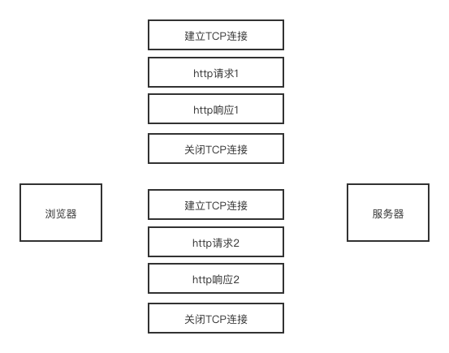
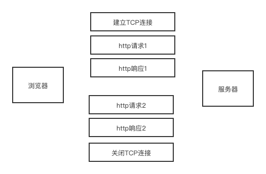
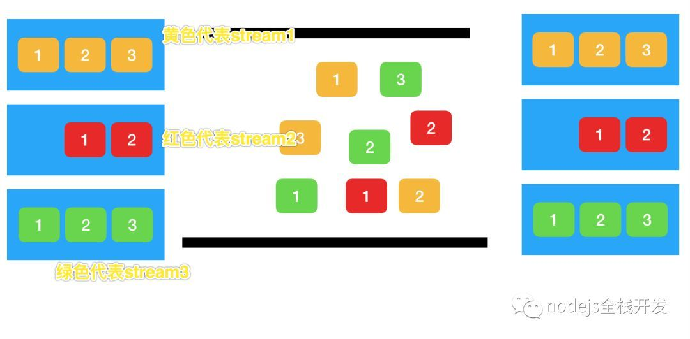
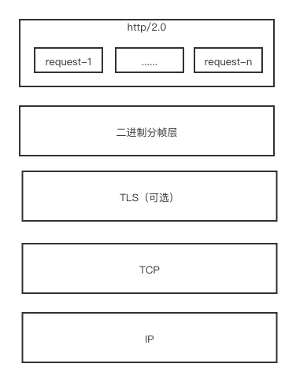

### [HTTP method](https://developer.mozilla.org/zh-CN/docs/Web/HTTP/Methods)

| 方法 | 作用 |
| - | -|
| [GET](https://developer.mozilla.org/en-US/docs/Web/HTTP/Methods/GET) | GET方法请求一个指定资源的表示形式. 使用GET的请求应该只被用于获取数据. |
| [HEAD](https://developer.mozilla.org/en-US/docs/Web/HTTP/Methods/HEAD) | HEAD方法请求一个与GET请求的响应相同的响应，但没有响应体.|
| [POST](https://developer.mozilla.org/en-US/docs/Web/HTTP/Methods/POST)  | POST方法用于将实体提交到指定的资源，通常导致在服务器上的状态变化或副作用. |
| [PUT](https://developer.mozilla.org/en-US/docs/Web/HTTP/Methods/PUT) | PUT方法用请求有效载荷替换目标资源的所有当前表示。
| [DELETE](https://developer.mozilla.org/en-US/docs/Web/HTTP/Methods/DELETE) | DELETE方法删除指定的资源。
| [CONNECT](https://developer.mozilla.org/en-US/docs/Web/HTTP/Methods/CONNECT) | CONNECT方法建立一个到由目标资源标识的服务器的隧道。
| [OPTIONS](https://developer.mozilla.org/en-US/docs/Web/HTTP/Methods/OPTIONS) | OPTIONS方法用于描述目标资源的通信选项。
| [TRACE](https://developer.mozilla.org/en-US/docs/Web/HTTP/Methods/TRACE) | TRACE方法沿着到目标资源的路径执行一个消息环回测试。
| [PATCH](https://developer.mozilla.org/en-US/docs/Web/HTTP/Methods/PATCH) | PATCH方法用于对资源应用部分修改。

### XMLHttpRequest
```js
  var xhr = new XMLHttpRequest();
  xhr.open(method, url);

  xhr.onreadystatechange = function() {
    if(xhr.readyState === XMLHttpRequest.DONE && xhr.status === 200) {
      console.log(xhr.responseText)
    }
  }
  xhr.send();
```


## http/0.9 http/1.0 http/1.1的发展

### http/0.9
- http/0.9是1991年提出的，该版本的只有get请求，被用来传输html超文本内容，如 `GET /index.html`所以又被称为**超文本传输协议**。

- http/0.9没有**http请求头和请求体**，同时服务器也没有返回头信息，只返回数据。

- 因为返回的都是HTML格式的文件，所以是使用 ASCII 字符码来传输的


### http/1.0
- http/1.0不单单是支持HTML文件的传输，还包含了js、css、图片、音频、视频等不同类型的的文件。也就是支持了多种类型的文件传输。

- 同时http/1.0引入了请求头和响应头，它们以`key-value`的形式保存。

- 引入了**状态码**，告知浏览器有的请求服务器无法处理。

- http/1.0加入了缓存机制，使用的是 `Pragma:no-cache` + `Last-Modified/If-Modified-Since`来作为缓存判断的标准；

- 增加了用户代理字段，用来统计不同客户端信息

**http/1.0的缺点：**

每次进行一次http通信，都需要经历一次完整的TCP连接、传输http数据、断开TCP连接三个阶段。由于在过去的页面中，通信的文件比较小，所以这种方式没有什么影响，但是由于web的发展，页面中可能包含几百个外部资源文件。这时候每次请求都再经历一次完整的TCP通道建立过程会增加很多的开销。

如下:
<div align="center">
   
</div>

### http/1.1

- http/1.1最大的变化就是引入了持久连接，在HTTP/1.1中默认开启 Connection: keep-alive，即TCP连接默认不关闭(只要浏览器或者服务器没有明确断开连接)，可以被多个请求复用。如下
<div align="center">
   
</div>

但是，这个方案并不完美，持久连接虽然能减少TCP的建立和断开次数，但是它需要等待前面的请求返回之后，才能进行下一次请求。如果某个请求因为某些原因未能及时响应，则就会出现**队头阻塞**。http/1.1试图通过**管线化**来解决队头阻塞。但是**管线化**只能是批量发送请求，但是**服务器还是需要根据请求顺序来响应**。由于存在各种问题，现在的主流浏览器基本都是默认关闭管线化。并且，使用条件比较苛刻，只有 GET、HEAD、PUT 和 DELETE 可以进行管线化， POST则有限制。**现阶段，浏览器厂商采用了另一种做法。它允许我们打开多个TCP会话，比如，我们常在浏览器中看到很多的并行请求，这是因为浏览器对同域名下并行下载6~8个资源的限制**。

- HTTP/1.1 引入了更多的缓存控制策略：`Cache-Control`、`Etag/If-None-Match`等

- 在 HTTP/1.0 中，每个域名绑定了一个唯一的 IP 地址，因此一个服务器只能支持一个域名。但是随着虚拟主机技术的发展，需要实现在一台物理主机上绑定多个虚拟主机，每个虚拟主机都有自己的单独的域名，这些单独的域名都公用同一个 IP 地址。因此，HTTP/1.1 的请求头中增加了 Host 字段，用来表示当前的域名地址，这样服务器就可以根据不同的 Host 值做不同的处理。

### http/1.1 的主要问题
**对带宽的利用率却并不理想**，**带宽是指每秒最大能发送或者接收的字节数**。我们把每秒能发送的最大字节数称为**上行带宽**，每秒能够接收的最大字节数称为**下行带宽**。

因为http/1.1很难将带宽利用满。比如我们常说的 100M 带宽，实际的下载速度能达到 12.5M/S，而采用 HTTP/1.1 时，也许在加载页面资源时最大只能使用到 2.5M/S。

造成这样的原因有
1. **TCP慢启动**
一旦一个 TCP 连接建立之后，就进入了发送数据状态，刚开始 TCP 协议会采用一个非常慢的速度去发送数据，然后慢慢加快发送数据的速度，直到发送数据的速度达到一个理想状态。

慢启动是 TCP 为了减少网络拥塞的一种策略，我们是没有办法改变的。

之所以说慢启动会带来性能问题，是因为页面中常用的一些关键资源文件本来就不大，如 HTML 文件、CSS 文件和 JavaScript 文件，通常这些文件在 TCP 连接建立好之后就要发起请求的，但这个过程是慢启动，所以耗费的时间比正常的时间要多很多，这样就推迟了宝贵的首次渲染页面的时长了。

2. **同时开启了多条 TCP 连接，那么这些连接会竞争固定的带宽。**
你可以想象一下，系统同时建立了多条 TCP 连接，当带宽充足时，每条连接发送或者接收速度会慢慢向上增加；而一旦带宽不足时，这些 TCP 连接又会减慢发送或者接收的速度。比如一个页面有 200 个文件，使用了 3 个 CDN，那么加载该网页的时候就需要建立 6 * 3，也就是 18 个 TCP 连接来下载资源；在下载过程中，当发现带宽不足的时候，各个 TCP 连接就需要动态减慢接收数据的速度。

这样就会出现一个问题，因为有的 TCP 连接下载的是一些关键资源，如 CSS 文件、JavaScript 文件等，而有的 TCP 连接下载的是图片、视频等普通的资源文件，但是多条 TCP 连接之间又不能协商让哪些关键资源优先下载，这样就有可能影响那些关键资源的下载速度了。

3. **队头阻塞问题**

虽然我们可以通过持久连接来复用TCP管道，但是，同一个管道，同一时刻只能处理一个请求。其他请求只能处于阻塞状态。假设一个请求被阻塞了5秒，那么后续的请求都需要延迟5秒，这个过程中，带宽、CPU都被浪费了。

### http/2.0

1. **多路复用**
HTTP/2 支持发起并行请求，即在一个连接里，客户端和浏览器都可以同时发送多个请求和响应，而不用按照顺序一一对应，这样避免了**队头阻塞**。

帧是http/2.0的最小通信单位，每个帧包含帧头部，也会标识出当前帧所属的流（stream id）。

比如，每个请求是一个数据流（stream），不同颜色代表不同的stream id，而当中的header， body会被切割为多个frame，并且标号。然后，http/2.0再根据streamid和每一帧的标号来恢复数据。这样，就实现了在一个tcp连接中的流式传输，多个request都会复用这个TCP通道
<div align="center">
   
</div>

<div align="center">
   
</div>
实现：
- 首先，浏览器准备好请求数据，包括了请求行、请求头等信息，如果是 POST 方法，那么还要有请求体。
- 这些数据经过二进制分帧层处理之后，会被转换为一个个带有请求 ID 编号的帧，通过协议栈将这些帧发送给服务器。
- 服务器接收到所有帧之后，会将所有相同 ID 的帧合并为一条完整的请求信息。
- 然后服务器处理该条请求，并将处理的响应行、响应头和响应体分别发送至二进制分帧层。
- 同样，二进制分帧层会将这些响应数据转换为一个个带有请求 ID 编号的帧，经过协议栈发送给浏览器。
- 浏览器接收到响应帧之后，会根据 ID 编号将帧的数据提交给对应的请求。


2. **服务端推送**
HTTP/2 允许服务器未经请求，主动向客户端发送资源，这叫做服务器推送（server push）。常见场景是客户端请求一个网页，这个网页里面包含很多静态资源。正常情况下，客户端必须收到网页后，解析HTML源码，发现有静态资源，再发出静态资源请求。其实，服务器可以预期到客户端请求网页后，很可能会再请求静态资源，所以就主动把这些静态资源随着网页一起发给客户端了。

3. **首部压缩**
HTTP 协议不带有状态，每次请求都必须附上所有信息。所以，请求的很多字段都是重复的，，一模一样的内容，每次请求都必须附带，这会浪费很多带宽，也影响速度。HTTP/2 对这一点做了优化，引入了头信息压缩机制（header compression）。一方面，头信息压缩后再发送（SPDY 使用的是通用的DEFLATE 算法，而 HTTP/2 则使用了专门为首部压缩而设计的 HPACK 算法）。；另一方面，客户端和服务器同时维护一张头信息表，所有字段都会存入这个表，生成一个索引号，以后就不发送同样字段了，只发送索引号，这样就提高速度了

4. **设置请求优先级**
多路复用可能导致关键请求被阻塞，可以在发送请求时，标上该请求的优先级，这样服务器接收到请求之后，会优先处理优先级高的请求。

## 总结
1. 在http/0.9中，因为场景简单，所以只支持了GET请求，且无请求头和响应头
2. http/1.0 中增加了响应头，支持了多种资源类型，并引入了缓存机制。但是，它的缺点是每次请求一个http连接，都需要建立和断开TCP连接。
3. http/1.1 做了如下优化
    - 增加持久连接
    - 浏览器为每个域名最多同时维护6个TCP持久连接
    - 使用CDN 实现域名分片机制
4. 但是http/1.1的对头阻塞问题，导致了后续请求的延迟，以及对带宽利用不充分。
5. http2.0增加二进制分帧、多路复用、头部压缩、服务端推送