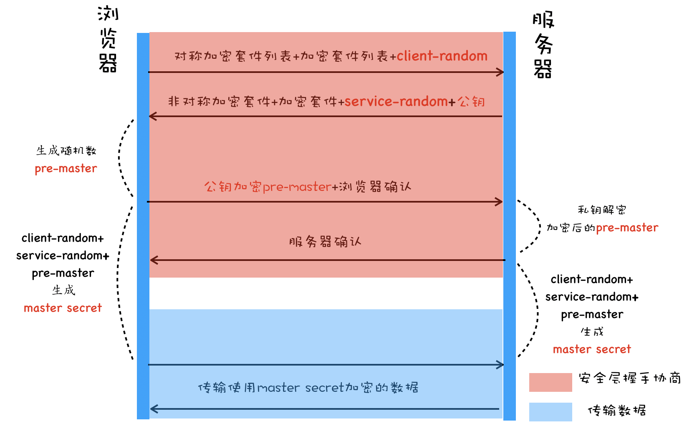

## HTTPS

https采用对称加密和非对称加密+数字证书的方式，对传输数据进行加密

**对称加密方式如下**
1. 客户端发送加密套件列表（就是客户端支持的加密方式）+ client-random
2. 服务器从加密套件中选择一个加密方式，并生成service-random + 新的加密套件返回给客户端
3. 最后浏览器和服务器分别返回确认消息

这样浏览器和服务器都有相同client-random和service-random，然后再使用相同的方法混合起来生成一个master-secret。
有了master-secret和加密套件后，双方就可以进行数据的加密传输了。

但是由于client-random和service-random是明文的。意味着中间人也可以拿到加密套件和双方随机数。由于利用随机数合成密钥的算法是公开的，所以中间人拿到随机数后，也可以合成密钥，然后破解数据

**非对称加密**
1. 首先浏览器会发送加密套件列表给服务器
2. 服务器会选择一个加密方式，和对称加密不同的是，使用非对称加密时，服务器上需要有用于浏览器加密的公钥和服务器解密的私钥。由于公钥是给浏览器加密用的，因此服务器会将加密套件和公钥一起发送给浏览器。

这样在浏览器向服务器发送数据时，就可以使用公钥来加密数据。由于公钥加密只有私钥才能解密，所以即使黑客截获了数据和公钥，他也无法获取数据。

但是有以下的缺点
- 非对称加密效率太低。严重影响到解密数据的数据，进而影响到用户打开页面的速度。
- 无法保证服务器发送给浏览器的数据安全。虽然浏览器端可以使用公钥来加密，但是服务器只能私钥加密。因此，当服务器发送数据和公钥的时候，中间人也是可以获取到公钥和私钥加密的数据的。这样就无法保证服务器端发送的数据安全。

**对称加密和非对称加密搭配使用**
相比较对称加密和非对称加密，采用两者相结合的方式则更加完美。**使用对称加密来传输数据，使用非对称加密来传输对称加密的密钥**。

1. 首先浏览器端会发送client-random、对称加密列表、非对称加密列表给服务器端
2. 服务器端选择并发送对称加密方式、非对称加密方式、service-random和公钥给浏览器端
3. 然后浏览器会生成一个随机数pre-master、然后通过非对称加密的方式。使用公钥加密pre-master给服务器端。（需要注意，pre-master是通过非对加密的公钥加密的，所以黑客是无法获取到私钥来解密数据的。）
4. 服务器端接收到使用公钥加密的pre-master，然后使用私钥解密获取到pre-master。（到此，浏览器端和服务器端都有了client-random、service-random、pre-master）
5. 使用 client-random、service-random、pre-master生成的**master secret**加密传输数据。

**添加数字证书**
虽然使用对称和非对称混合加密的方式，完美的实现了数据的加密传输。但是黑客可以通过DNS劫持将网站的ip换成自己的ip。这样，对于用户来说，其实访问的就是黑客的服务器了。黑客就可以在自己的服务器上实现公钥和私钥。对于浏览器而言，它完全不知道现在在访问黑客的站点。

所以需要有个第三方的权威机构来向浏览器证明“服务器”就是服务器。比如，买了房子，需要证明这个房子是你的。那么这里的房管局就是一个**第三方权威机构**。而房产证就是**证书**。

同理，网站A要证明服务器就是网站A的，也需要一个权威机构来颁发证书。这个权威机构就是**CA(Certificate Authority)**，颁发的证书就是**数字证书（Digital Certificate)**。

对于浏览器来说，数字证书的作用就是：1、通过证书向浏览器证明身份。2、包含服务器的公钥。

所以，包含了数字证书的https，与“对成与分对称结合”的方法相比，改变了如下两点：
1. 服务器不返回公钥，而是数字证书。
2. 客户端会多一个数字证书检验的过程，检验完成后才继续下面的流程

这样就算是黑客仿造了服务器，但是由于数字证书是无法仿造的。所以依然无法欺骗客户端（用户）

**申请数字证书**

- 首先网站A需要准备一套私钥和公钥，私钥留着自己使用；
- 然后网站A向 CA 机构提交公钥、公司、站点等信息并等待认证，这个认证过程可能是收费的；
- CA 通过线上、线下等多种渠道来验证网站A所提供信息的真实性，如公司是否存在、企业是否合法、域名是否归属该企业等；
- 如信息审核通过，CA 会向网站A签发认证的数字证书，包含了网站A的公钥、组织信息、CA 的信息、有效时间、证书序列号等，这些信息都是明文的，同时包含一个 CA 生成的签名。

最后一步的数字签名的步骤：Hash函数计算网站提供的明文信息，得出信息摘要 -> CA使用密钥加密信息摘要，密文就是CA颁发给网站的数字签名

这就相当于房管局在房产证上盖的章，这个章是可以去验证的，同样我们也可以通过数字签名来验证是否是该 CA 颁发的。

**浏览器如何验证数字证书**
有了CA签名过的数字证书后，当浏览器向服务器发出请求时，服务器会返回数字证书给浏览器。

浏览器接收到数字证书后，会进行验证。
1. 首先浏览器读取证书的明文信息，采用CA签名是相同的Hash函数计算并得到**信息摘要A**
2. 利用CA的公钥解密签名数据，得到**信息摘要B**； 如果 `A === B`,则证书合法，服务器是网站A的

如果该CA比较小众，浏览器不知道该不该信任，则浏览器继续查找给当前CA颁发证书的CA，然后再以同样的方式验证他的上级CA。通常情况下，操作系统中会内置信任的顶级CA的证书信息（包含公钥），如果这个CA链中没有找到浏览器内置的顶级CA，证书也会被判定非法。

在申请和使用证书的过程中，还需要注意以下三点：

1. 申请数字证书是不需要提供私钥的，要确保私钥永远只能由服务器掌握；
2. 数字证书最核心的是 CA 使用它的私钥生成的数字签名；
3. 内置 CA 对应的证书称为根证书，根证书是最权威的机构，它们自己为自己签名，我们把这称为自签名证书。