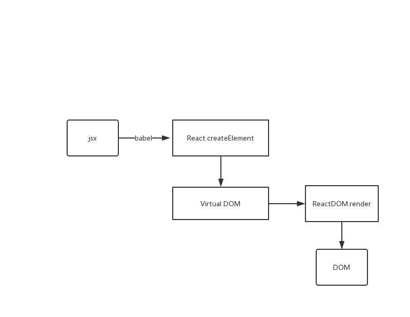

# 在react中，是如何生成DOM的呢?
首先我们先上一张图，然后我们跟着图片流程逐步分析


### React.createElement(type, [props], [...children])
React暴露出了createElement用于给我们创建Virtual DOM。它接收三个参数:type,是一个标签名(例如`div`, `span`), props则是当前节点上带有的属性, children表示子节点。

这一步的执行过程大概如下
`createElementWithValidation -> createElement -> ReactElement`
最后返回如下结构的虚拟DOM对象
```javascript
{
    // This tag allows us to uniquely identify this as a React Element
    $$typeof: REACT_ELEMENT_TYPE,
    // Built-in properties that belong on the element
    type: type,
    key: key,
    ref: ref,
    props: props,
    // Record the component responsible for creating this element.
    _owner: owner,
    _store: {}
};
```

### ReactDOM.render(element/*vDOM对象，如上*/, container, [callback])
该方法用来渲染顶层的React组件，也就是`Virtual DOM`的顶层对象。然后执行`legacyRenderSubtreeIntoContainer`。

在`legacyRenderSubtreeIntoContainer`中, 初始化时，如果当前节点为根节点，那么，会走到如下的分支中
```javascript
  
  if (!root) {
    // 通过legacyCreateRootFromDOMContainer，最后会执行到FiberRootNode构造函数，创建根节点的Fiber
    // Initial mount
    root = container._reactRootContainer = legacyCreateRootFromDOMContainer(
      container,
      forceHydrate,
    );
    fiberRoot = root._internalRoot;

    /** 删除处理callback的代码 **/

    // Initial mount should not be batched.
    unbatchedUpdates(() => {
      updateContainer(children, fiberRoot, parentComponent, callback);
    });
  }
```

然后通过`legacyCreateRootFromDOMContainer`进入`FiberRootNode`生成一个根Fiber结构，大致如下
```javascript
  
function FiberRootNode(containerInfo, tag, hydrate) {
  this.tag = tag;
  this.current = null;
  this.containerInfo = containerInfo;
  this.pendingChildren = null;
  this.pingCache = null;
  this.finishedExpirationTime = NoWork;
  this.finishedWork = null;
  this.timeoutHandle = noTimeout;
  this.context = null;
  this.pendingContext = null;
  this.hydrate = hydrate;
  this.callbackNode = null;
  this.callbackPriority = NoPriority;
  this.firstPendingTime = NoWork;
  this.firstSuspendedTime = NoWork;
  this.lastSuspendedTime = NoWork;
  this.nextKnownPendingLevel = NoWork;
  this.lastPingedTime = NoWork;
  this.lastExpiredTime = NoWork;

  if (enableSchedulerTracing) {
    this.interactionThreadID = tracing.unstable_getThreadID();
    this.memoizedInteractions = new Set();
    this.pendingInteractionMap = new Map();
  }

  if (enableSuspenseCallback) {
    this.hydrationCallbacks = null;
  }
}
```


在讲`upbatchedUpdates`前，我们看一下一些常量和变量
```javascript
const NoContext = /*                    */ 0b000000;
const BatchedContext = /*               */ 0b000001;
const EventContext = /*                 */ 0b000010;
const DiscreteEventContext = /*         */ 0b000100;
const LegacyUnbatchedContext = /*       */ 0b001000;
const RenderContext = /*                */ 0b010000;
const CommitContext = /*                */ 0b100000;

// 描述当前的执行栈
// Describes where we are in the React execution stack
let executionContext: ExecutionContext = NoContext;
```
上面的一些常量都是定义的React中对应的执行站。变量`executionContext`则记录当前的执行栈.

现在，我们回到`upbatchedUpdates`方法中
这是首次渲染时才会进入的函数，**是不是为了消除批量更新，加快首屏渲染速度？**

```javascript
export function unbatchedUpdates<A, R>(fn: (a: A) => R, a: A): R {
  // 暂存当前执行栈
  const prevExecutionContext = executionContext;、
  // 更改执行栈
  executionContext &= ~BatchedContext;
  executionContext |= LegacyUnbatchedContext;
  // 最后通过 "|=" 将当前的执行栈更改为 "LegacyUnbatchedContext"
  try {
    // 回调就是updateContainers
    return fn(a);
  } finally {
    // 在执行完回调之后，会恢复执行栈
    executionContext = prevExecutionContext;
    if (executionContext === NoContext) {
      // Flush the immediate callbacks that were scheduled during this batch
      flushSyncCallbackQueue();
    }
  }
}
```

然后进入`updateContainer`
通过`requestCurrentTimeForUpdate`计算出当前时间`currentTime`,该值分为三种
```javascript
function requestCurrentTimeForUpdate() {
  if ((executionContext & (RenderContext | CommitContext)) !== NoContext) {
    // React内部
    return msToExpirationTime(now());
  } 
  // 可能处于浏览器的事件中
  if (currentEventTime !== NoWork) {
    // Use the same start time for all updates until we enter React again.
    return currentEventTime;
  }
  // 这个react创建后的第一次更新，重新计算开始时间
  currentEventTime = msToExpirationTime(now());
  return currentEventTime;
}
```
